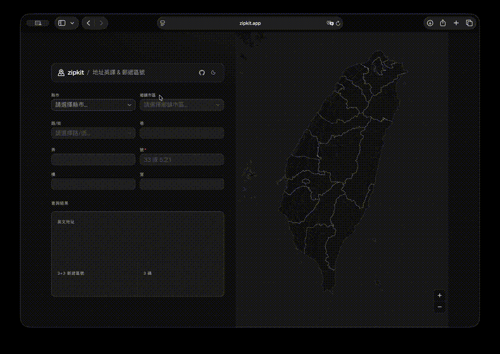

# Zipkit

[](https://github.com/ronload/zipkit/actions/workflows/ci.yml)
[](LICENSE)
[](https://zipkit.app)
[](https://pnpm.io/)
[](https://www.typescriptlang.org/)

台灣地址英譯與 3+3 郵遞區號查詢工具。

輸入中文地址，即時取得 UPU 格式英譯地址與六碼郵遞區號。純前端運作，所有資料皆為預先產生的靜態 JSON，無需後端 API。

**Live** -- [zipkit.app](https://zipkit.app)



## 功能

- 縣市、鄉鎮市區、路街逐級聯動選擇
- 路街名稱支援模糊搜尋（cmdk combobox）
- 巷、弄、號、樓、室明細輸入
- 即時產出英譯地址（UPU 格式）
- 六碼郵遞區號（3+3）精確比對
- 台灣行政區互動地圖，點擊即可選取縣市與鄉鎮市區
- 地區可視化
- 一鍵複製結果
- 深色模式介面

## 技術棧

- [Next.js](https://nextjs.org/) 16 (App Router)
- [React](https://react.dev/) 19
- [Tailwind CSS](https://tailwindcss.com/) 4
- [shadcn/ui](https://ui.shadcn.com/) 4 / [mapcn](https://mapcn.vercel.app/)
- [MapLibre GL JS](https://maplibre.org/) -- 台灣行政區地圖
- [TypeScript](https://www.typescriptlang.org/) 6
- [pnpm](https://pnpm.io/) 套件管理

## 快速開始

```bash
# 安裝依賴
pnpm install

# 啟動開發伺服器
pnpm dev
```

瀏覽器開啟 `http://localhost:3000` 即可使用。

## 指令

| 指令              | 說明                        |
| ----------------- | --------------------------- |
| `pnpm dev`        | 啟動開發伺服器              |
| `pnpm build`      | 正式環境建置                |
| `pnpm lint`       | 執行 ESLint 檢查            |
| `pnpm typecheck`  | TypeScript 型別檢查         |
| `pnpm format`     | 格式化程式碼 (Prettier)     |
| `pnpm check`      | 一次執行 typecheck + lint + format check |
| `pnpm etl`        | 從原始資料重新產生靜態 JSON |

## 架構

### 資料流程（ETL）

原始郵政資料放置於 `scripts/raw/`（不納入版本控制）。ETL 腳本（`scripts/etl.ts`）處理兩份來源：

```
CityCountyData.json + AllData.json  -->  public/data/base.json（縣市／鄉鎮市區索引）
                                         public/data/roads/{zip3}.json（各區路街清單）

rall1.txt (CSV)                     -->  public/data/zip-ranges/{zip3}.json（郵遞區號範圍規則）
```

- `base.json` 在建置時靜態匯入，包含所有縣市與鄉鎮市區
- `roads/{zip3}.json` 與 `zip-ranges/{zip3}.json` 於使用者選擇鄉鎮市區時按需載入並快取

### 郵遞區號比對

`src/lib/lookup-zipcode.ts` 以特異性評分（specificity scoring）比對地址與郵遞區號範圍規則。條件越多（巷段、弄段、門牌範圍、單雙號、樓層）的規則分數越高，優先採用。支援門牌之號（如「5之1」）與樓層限制等進階比對。

### 狀態管理

`src/hooks/use-address-state.ts` 以 `useReducer` 管理聯動表單狀態。選擇上層欄位時自動重設下層欄位。路街與郵遞區號資料透過 `src/lib/data-loader.ts` 按需載入並快取於記憶體中。

## 專案結構

```
src/
  app/          # Next.js App Router 頁面
  components/   # UI 元件
  hooks/        # React hooks（地址狀態管理）
  lib/          # 工具函式（郵遞區號比對、資料載入）
scripts/
  etl.ts        # ETL 資料轉換腳本
  raw/          # 原始郵政資料（不納入版本控制）
public/
  data/         # 預先產生的靜態 JSON
```

## 資料來源

本專案使用以下第三方開源資料：

- **地址中英對照** -- [donma/TaiwanAddressCityAreaRoadChineseEnglishJSON](https://github.com/donma/TaiwanAddressCityAreaRoadChineseEnglishJSON)
  提供台灣縣市、鄉鎮市區、路街的中英文對照資料（`CityCountyData.json`、`AllData.json`）。
- **3+3 郵遞區號範圍** -- [中華郵政 3+3 郵遞區號查詢](https://www.post.gov.tw/post/internet/Download/index.jsp?ID=2292)
  提供各地址區段對應的六碼郵遞區號範圍資料（`rall1.txt`）。

## 授權

本專案採用 [MIT License](LICENSE) 授權。
